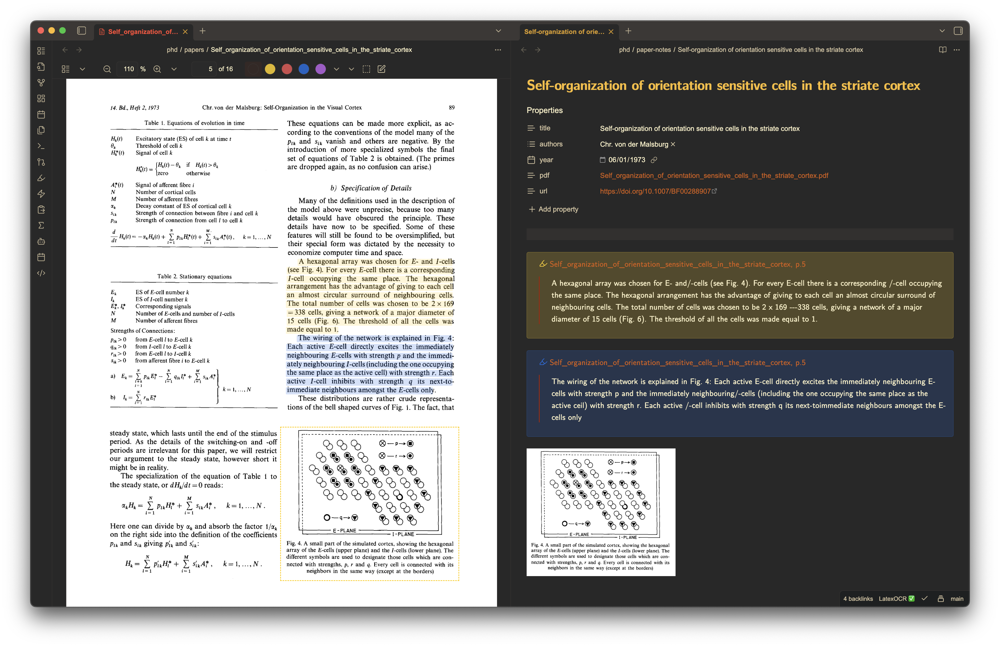
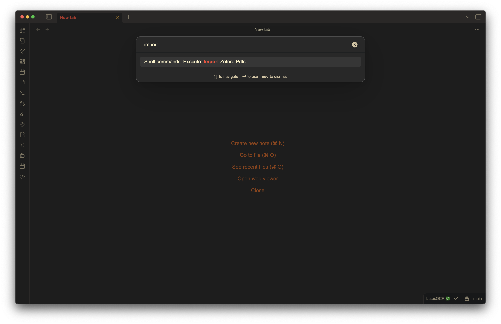

This is a tool for getting PDF files and all their associated metadata from Zotero into Obsidian for better note taking. I don't enjoy reading or taking notes on papers in Zotero, but I love taking  but I love taking notes in Obsidian. What Zotero does very well however, is download PDFs of papers and get all the author info, DOI, etc. Why not have the best of both worlds?

To get started you'll need to fill out the fields in `config.yaml` with the correct file paths. The tool assumes you have two folders in your Obsidian vault. One for storing papers (symbolic links to the PDFs in Zotero), and another for their accompanying notes. Once you have that setup, you'll need to get your Zotero API key and make sure you have [pyzotero](https://github.com/urschrei/pyzotero) installed. Then just run `note_builder.py`!

As of now the script only works for PDFs and meets most of my needs. I may extend it in the future.

### Example

I recommend the PDF++ and Shell Commands plugins to make getting your papers into Obsidian and taking beautiful notes as seamless as possible.

### Importing new papers from the command palette
